# AIM2 Project Ticket Dependencies

## Dependency Overview

### Critical Path Analysis

```mermaid
graph TD
    %% Infrastructure Layer
    AIM2-001[Project Setup] --> AIM2-002[Environment Config]
    AIM2-001 --> AIM2-003[Config Management]
    AIM2-003 --> AIM2-004[Logging Framework]
    AIM2-003 --> AIM2-051[LLM Interface]
    
    %% LLM Layer
    AIM2-051 --> AIM2-052[Local LLM]
    AIM2-051 --> AIM2-053[Cloud LLM]
    AIM2-051 --> AIM2-054[Prompt Optimization]
    AIM2-051 --> AIM2-055[Synthetic Data Gen]
    
    %% Ontology Development Path
    AIM2-011[Ontology Models] --> AIM2-012[Ontology Parser]
    AIM2-011 --> AIM2-018[Relationship Manager]
    AIM2-012 --> AIM2-013[Ontology Manager]
    AIM2-013 --> AIM2-014[External Downloaders]
    AIM2-013 --> AIM2-015[Intelligent Trimmer]
    AIM2-013 --> AIM2-016[Integration Engine]
    AIM2-013 --> AIM2-020[Persistence Layer]
    AIM2-051 --> AIM2-015
    AIM2-016 --> AIM2-017[Conflict Resolution]
    AIM2-051 --> AIM2-017
    AIM2-018 --> AIM2-019[Relationship Inference]
    AIM2-051 --> AIM2-019
    
    %% Information Extraction Path
    AIM2-031[Document Parser] --> AIM2-032[Corpus Builder]
    AIM2-032 --> AIM2-033[PubMed Integration]
    AIM2-055 --> AIM2-034[Synthetic Papers]
    AIM2-035[Text Preprocessing] --> AIM2-036[NER Framework]
    AIM2-036 --> AIM2-037[BERT NER]
    AIM2-036 --> AIM2-038[LLM NER]
    AIM2-051 --> AIM2-038
    AIM2-037 --> AIM2-039[Entity Post-processing]
    AIM2-038 --> AIM2-039
    AIM2-036 --> AIM2-040[Relationship Framework]
    AIM2-040 --> AIM2-041[LLM Relationships]
    AIM2-051 --> AIM2-041
    AIM2-039 --> AIM2-042[Ontology Mapping]
    AIM2-013 --> AIM2-042
    
    %% Evaluation Path
    AIM2-055 --> AIM2-043[Benchmark Generator]
    AIM2-034 --> AIM2-043
    AIM2-044[Evaluation Metrics] --> AIM2-045[Benchmarking System]
    AIM2-043 --> AIM2-045
    
    %% Integration Layer
    AIM2-013 --> AIM2-061[Pipeline Integration]
    AIM2-032 --> AIM2-061
    AIM2-040 --> AIM2-061
    AIM2-061 --> AIM2-062[CLI]
    AIM2-061 --> AIM2-063[Unit Tests]
    AIM2-061 --> AIM2-064[Integration Tests]
    AIM2-061 --> AIM2-065[Documentation]
    AIM2-064 --> AIM2-066[Performance Opt]
    AIM2-043 --> AIM2-067[Validation Data]
    AIM2-065 --> AIM2-068[Deployment]
    AIM2-061 --> AIM2-069[Examples]
    
    %% Final Testing
    AIM2-063 --> AIM2-070[Final Testing]
    AIM2-064 --> AIM2-070
    AIM2-065 --> AIM2-070
    AIM2-066 --> AIM2-070
    AIM2-067 --> AIM2-070
    AIM2-068 --> AIM2-070
    AIM2-069 --> AIM2-070
    
    style AIM2-001 fill:#90EE90
    style AIM2-002 fill:#90EE90
    style AIM2-003 fill:#FFD700
    style AIM2-005 fill:#90EE90
    style AIM2-011 fill:#90EE90
    style AIM2-031 fill:#90EE90
    style AIM2-035 fill:#90EE90
    style AIM2-044 fill:#90EE90
    style AIM2-051 fill:#FFD700
    style AIM2-013 fill:#FFD700
    style AIM2-036 fill:#FFD700
```

## Development Phases

### Phase 1: Foundation (Week 1-2)
**Independent tickets to start immediately:**
- AIM2-001: Project Repository Setup
- AIM2-002: Development Environment
- AIM2-003: Configuration Management ⚡
- AIM2-005: Exception Classes
- AIM2-011: Ontology Data Models
- AIM2-031: Document Parser Framework
- AIM2-035: Text Preprocessing
- AIM2-044: Evaluation Metrics

### Phase 2: Core Infrastructure (Week 3-4)
**Critical dependencies:**
- AIM2-051: LLM Interface ⚡ (blocks 11 other tickets)
- AIM2-012: Ontology Parser
- AIM2-036: NER Framework ⚡

### Phase 3: Primary Features (Week 5-7)
**Ontology Track:**
- AIM2-013: Ontology Manager ⚡
- AIM2-015: Intelligent Trimmer
- AIM2-016: Integration Engine
- AIM2-018: Relationship Manager

**Extraction Track:**
- AIM2-032: Corpus Builder
- AIM2-037: BERT NER
- AIM2-038: LLM NER
- AIM2-040: Relationship Framework

### Phase 4: Advanced Features (Week 8-9)
- AIM2-055: Synthetic Data Generator
- AIM2-041: LLM Relationships
- AIM2-042: Ontology Mapping
- AIM2-043: Benchmark Generator
- AIM2-045: Benchmarking System

### Phase 5: Integration & Polish (Week 10)
- AIM2-061: Pipeline Integration
- AIM2-063: Unit Tests
- AIM2-064: Integration Tests
- AIM2-070: Final Testing

## Key Insights

### 🟢 Green Light Tickets (Start Anytime)
8 tickets with no dependencies - perfect for parallel development

### 🟡 Critical Path Tickets
- **AIM2-003**: Configuration Management (blocks LLM functionality)
- **AIM2-051**: LLM Interface (blocks 11 AI-powered features)
- **AIM2-013**: Ontology Manager (blocks integration features)
- **AIM2-036**: NER Framework (blocks extraction pipeline)

### 📊 Dependency Statistics
- **Most Dependencies**: AIM2-070 (depends on all tickets)
- **Most Depended Upon**: AIM2-051 (11 tickets depend on it)
- **Longest Chain**: 6 levels deep (Infrastructure → LLM → Features → Integration → Testing)

### 🚀 Recommended Parallel Tracks

**Track A: Ontology Development**
1. AIM2-011 → AIM2-012 → AIM2-013 → Features

**Track B: Information Extraction**  
1. AIM2-035 → AIM2-036 → AIM2-037/038 → Features

**Track C: Infrastructure**
1. AIM2-003 → AIM2-051 → LLM Features

These tracks can be developed in parallel by different team members, converging at the integration phase.